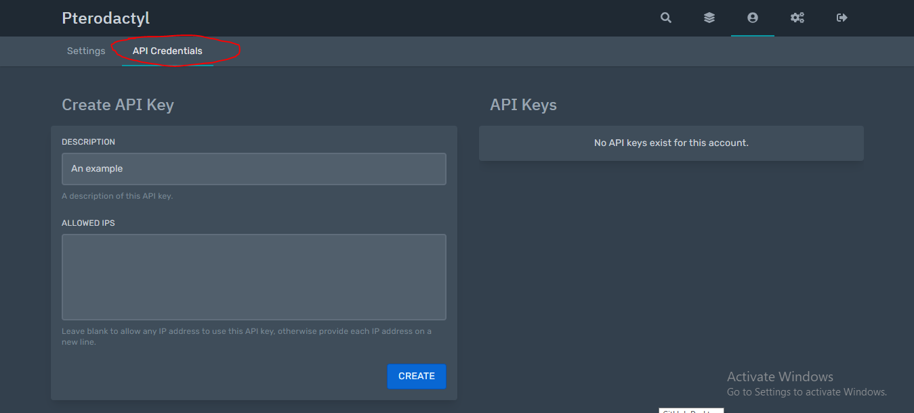

# Getting Started

## Step 1: Importing the library <a id="step-1-importing-the-library"></a>

The first step to do with nodeactyl, is importing the library. This will import all the code so that you can use it within your node.js application.

```javascript
const Nodeactyl = require('nodeactyl');
```

The variable name can be anything you choose, in this instance Nodeactyl has been used.

## Step 2: Logging into the API <a id="step-2-logging-into-the-api"></a>

Once you have imported the library, you then need to log into the pterodactyl API so that nodeactyl can interact with the panel and servers.

### Getting the API Key <a id="getting-the-api-key"></a>

Before we can log into the panel, we first need to get the API key so we can login into the panel. You can get this key from 2 places, either a client key, or an admin key.

You must have access to the admin area on pterodactyl to get an admin key. If you want to do things such as create servers, delete servers and get any server info an admin key is **Required.**

#### Client Key <a id="client-key"></a>


After that you need to click the "API Credentials" tab



After that, set a description for your API Key, and click "create" from there you are given the option to copy & paste your API Key, use this for our API.

#### Admin Key <a id="admin-key"></a>

To get the API key, the first thing you need to do is go into the admin area. If you don't know how to do this, I won't show you as you will need to know how to use pterodactyl to be successful with this API.


You first need to select Application API


You then need to press the Create New button to begin the creation of an API key.


You must then select the permissions you would like it to have, once done, press create.

### Using the API Key <a id="using-the-api-key"></a>

One you have your API key and nodeactyl installed, you will need to set it up for the application key you got, here is an example:

```javascript
/** If you want the application sided API, use this */
let admin = new Nodeactyl.NodeactylApplication("https://your.panel.net", "YourApplicationAPIKey");

/** If you want the client sided API, use this */
let client = new Nodeactyl.NodeactylClient("https://your.panel.net", "YourClientAPIKey");
```

​

