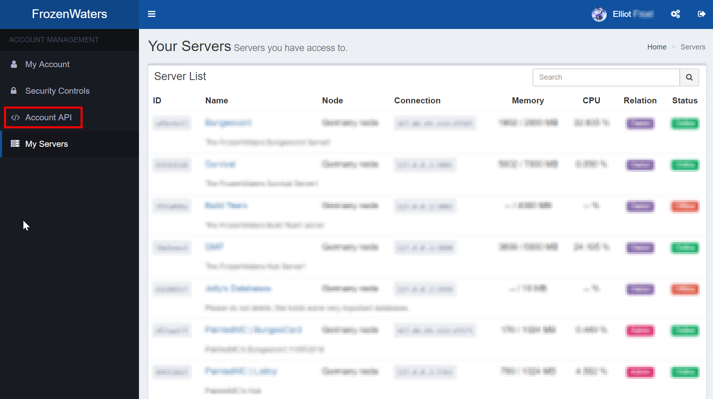
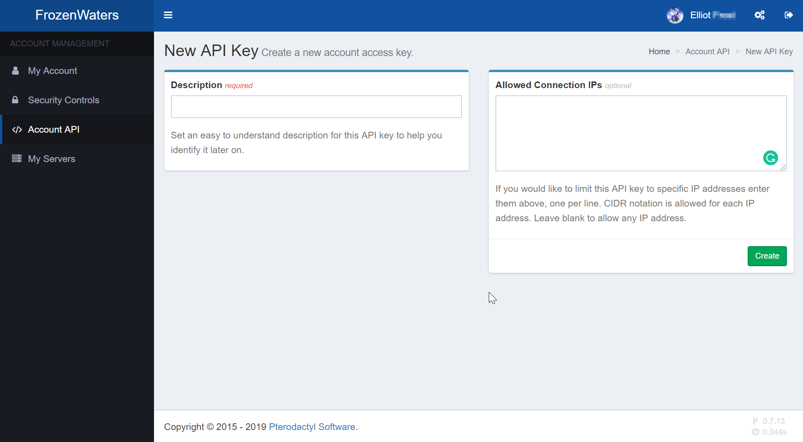
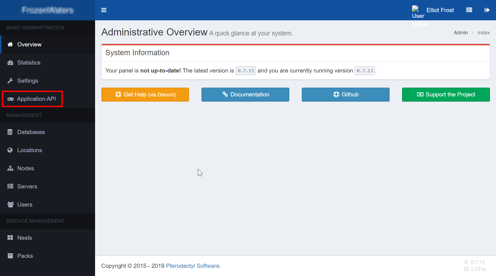

# \[OLD\] Getting Started

## Step 1: Importing the library

The first step to do with nodeactyl, is importing the library. This will import all the code so that you can use it within your node.js application.

```javascript
const node = require('nodeactyl');
```


The variable name can be anything you choose, in this instance `node` has been used.


## Step 2: Logging into the API

Once you have imported the library, you then need to log into the pterodactyl API so that nodeactyl can interact with the panel and servers.

### Getting the API Key

Before we can log into the panel, we first need to get the API key so we can login into the panel. You can get this key from 2 places, either a client key, or an admin key.


You must have access to the admin area on pterodactyl to get an admin key. If you want to do things such as create servers, delete servers and get any server info an admin key is **Required.**


#### Client Key






#### Admin Key

To get the API key, the first thing you need to do is go into the admin area. If you don't know how to do this, I won't show you as you will need to know how to use pterodactyl to be successful with this API.




### Using the API Key

One you have your API key and nodeactyl installed, you will need to set it up for the application key you god, here is an example:

```javascript
const node = require('nodeactyl');
const application = node.Application;
```


`node.Client` is used for client connections. 


Now to login you will need to use this:

```javascript
application.login('HOST', 'API KEY', (logged_in, msg) => {
    console.log(logged_in); // return a Boolean (true/false) if logged in.
})
```


`msg` Will only be applicable if the key is invalid, this function is not a promise so do not `.catch` it, the `msg` property will tell you the issue with your credentials.




Otherwise, if you have an admin key, you can run any functions:






